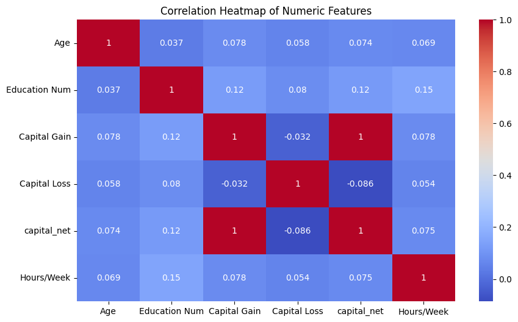
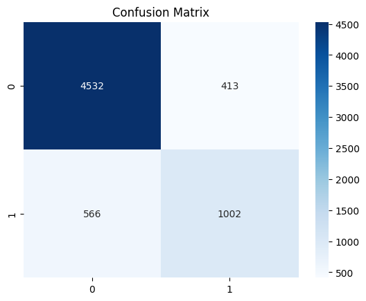

# 🧠 Adult Income Prediction Using Machine Learning
Predict whether an individual earns **more than $50K/year** using demographic and socioeconomic data.  
This project demonstrates a complete **end-to-end ML pipeline** including data cleaning, EDA, feature engineering, class balancing, model building, tuning, and evaluation.

---

## 🚀 Open in Google Colab
[](https://colab.research.google.com/drive/1Hga7Pz-Jx10Y0d2EUJSkjPqMhWEG1U99?usp=sharing)

---

## 📌 Project Overview
This project uses the **Adult Census Income dataset** to classify individuals into income groups:

- **>50K (High Income)**
- **≤50K (Low Income)**

The workflow includes:
- Exploratory Data Analysis (EDA)
- Data preprocessing and cleaning
- Feature engineering
- SMOTE-based class balancing
- Machine learning model training
- Hyperparameter tuning (RandomizedSearchCV)
- Model evaluation and export using `joblib`

---

## 🛠️ Technologies & Libraries Used

| Category | Tools |
|---------|--------|
| Core Language | Python |
| Data Handling | Pandas, NumPy |
| Visualization | Matplotlib, Seaborn |
| ML Models | Scikit-learn |
| Class Balancing | imbalanced-learn (SMOTE) |
| Model Saving | joblib |
| Environment | Google Colab |

---

## 🔍 Key Features of the Project

### 🎨 Exploratory Data Analysis
- Correlation heatmap  
- Histograms & countplots  
- Categorical vs income comparison  
- Feature importance (Random Forest)  
- ROC Curve  
- Actual vs Predicted comparison table  

---

### ⚙️ Feature Engineering
- Created new feature: **Capital Net = capital-gain – capital-loss**
- One-hot encoding for categorical features  
- Scaling and normalization  
- Missing value imputation  

---

### 🧽 Data Cleaning
- Removed invalid entries  
- Handled missing values  
- Normalized numerical features  
- Encoded categorical variables  

---

## 📊 Machine Learning Models

### Models Implemented:
- **Random Forest (Tuned)**
- **Logistic Regression**

### Class Imbalance Handling:
Original:  
- **75% Low Income**  
- **25% High Income**

Balanced with **SMOTE → 50% : 50%**

---

## 📈 Performance Summary

| Model | Accuracy | F1-score | AUC | Remarks |
|-------|----------|----------|------|---------|
| **Random Forest (Tuned)** | ~85–88% | High | **>0.90** | Best performer |
| Logistic Regression | ~78–80% | Moderate | ~0.85 | Baseline |

---

## 🖼️ Sample Visuals (Add When Files Are Uploaded)

### 🔥 Correlation Heatmap


### 🌟 Confusion Matrix


### 📉 ROC Curve


---

## 📁 Project Structure

```
/adult-income-prediction/
├── assets/                     # Visualizations (to be uploaded)
├── AdultML.ipynb               # Colab notebook
└── README.md                   # Project documentation
```

---

## 🎯 Use Case Applications
Income prediction can be useful for:

- Market segmentation  
- Financial risk assessment  
- Targeted marketing  
- Public policy analysis  
- Socio-economic research  

---

## 📚 Dataset Source
UCI Machine Learning Repository – Adult Census Income Dataset  
(~32,000+ rows)

---

## 👩‍💻 Author
**Barna Das**  
GitHub: https://github.com/barna-d

---

## 📝 License
Released under **MIT License**.
